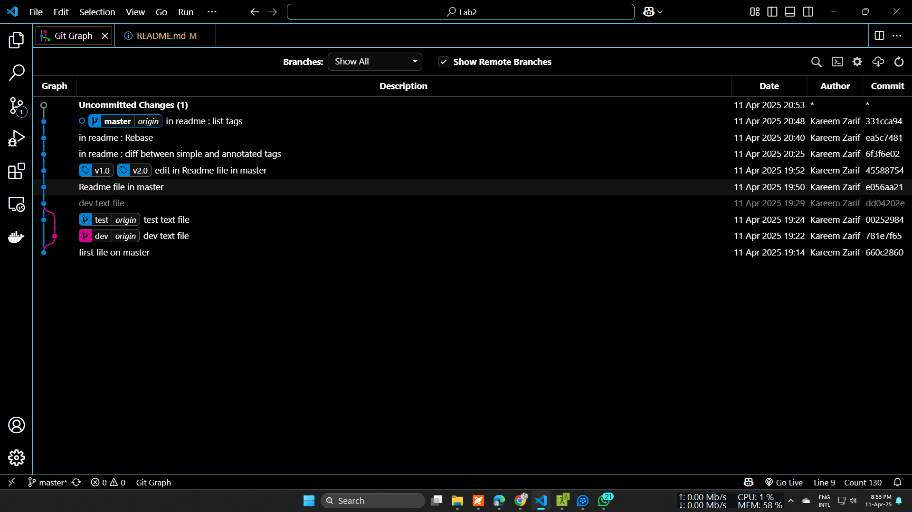

# Lab2

### Remove Branches
#### Remove Branches Locally
```bash
git branch -d branch_name
```

#### Remove Branches Remotely
```bash
git push origin :branch_name
```

--------------------------------------

### **Tags**
1. **Lightweight Tags**
   - For quick, local references (e.g., marking a commit for testing).
   - No tagger info (name, email, date).
   - No message (description).

2. **Annotated Tags**
   - For releases where metadata matters (e.g., v1.0.0).
   - Includes tagger name, email, and date of tagging.
   - A description message.

--------------------------------------

## When to Use **Rebase**
When merging branches, multiple commits on older branches can be unnecessary and should be consolidated into one commit on top of the main branch. 

- **Result:** A linear, clean history without extra merge commits.  
- **Avoid:** Rebasing public/shared (remote) branches, as this can cause conflicts.

```bash
git checkout feature-branch
git rebase main
```

--------------------------------------

### List Tags
1. To list all tags:
   ```bash
   git tag
   ```

2. To list tags with annotations:
   ```bash
   git tag -n
   ```

--------------------------------------

### Delete Tags
*Deleted tags are not recoverable.*  
*Since tags are only pointers, deleting tags does not affect commits.*

1. Delete locally:
   ```bash
   git tag -d <tagName>
   ```

2. Delete remotely:
   ```bash
   git push origin --delete <tagName>
   ```

--------------------------------------

## My Branches Merging
